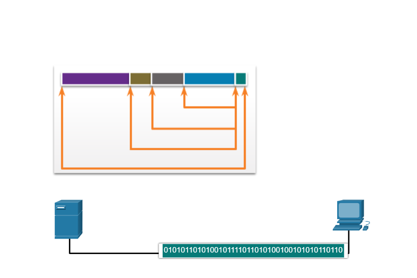
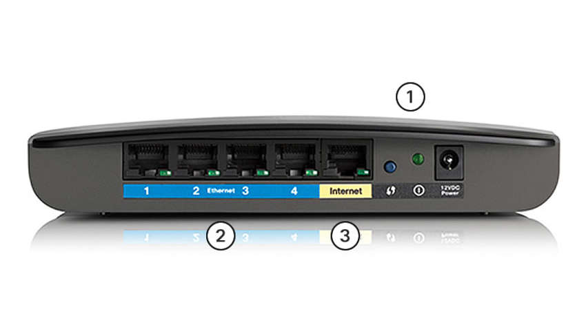

# cisco-ccna
Repository ini untuk dokumentasi belajar guna mempersiapkan ujian Cisco CCNA sebagai Network Engineer / Teknisi Jaringan. Penjelasan materi yang saya jabarkan di sini adalah murni hasil translasi saya dari berbagai sumber. Dengan kata lain translasi ini 99% akurat karena tidak menggunakan mesin penerjamah / translasi.

# Physical Layer / Lapisan Fisik

Physical Layer atau biasa disebut lapisan fisik berfungsi untuk mengirim data dalam bentuk <i>bits</i> ke lapisan atasnya yaitu <i>Data Link</i> 

Lapisan fisik ini meneruskan <i>frame</i> dari <i>Data Link</i> lalu <i>meng-encode</i> sinyal yang ditransmisikan ke media local

<ul>
	<li>Lapisan fisik tidak terbatas oleh <b>jaringan kabel</b> maupun jaringan <i>Wireless</i></li>
	<li>Setelah data menuju lapisan fisik, data akan dikirim ke lapisan <i>Data Link</i></li>
	<li>Ketika data <i>ter-encoded</i> oleh lapisan fisik, data tidak dikirim dalam waktu yang bersamaan</li>
	<li>Frame adalah PDU yang diterima oleh lapisan fisik saat proses transimisi data</li>
</ul>

# Tujuan Physical Layer / Lapisan Fisik

Saat terhubung ke printer baik di rumah saat di kantor, sebelum jaringan dapat berkomunasi, koneksi fisik ke jaringan lokal akan terjadi.

Jenis / tipe koneksi tergantung dari setup / peralatan jaringan. Misalnya saja, di berbagai kantor perusahaan, karyawan memiliki PC Desktop atau laptop yang terhubung ke jaringan secara fisik. Janis jaringan ini disebut jaringan kabel atau biasa disebut <i>Wired Network</i>. Data ditransmisikan lewat kabel fisik.

Selain itu, banyak perusahaan yang menawarkan jaringan <i>wireless</i> atau koneksi tanpa kabel. Dengan begini data akan dikirimkan melalu gelombang radio. Sebuah peralatan jaringan <i>wireless</i> harus dikoneksikan ke perangkat yang bernama <i>Access Point</i>(AP) maupun <i>Wireless Router</i> seperti yang ditunjukkan gambar berikut

# Wireless Router

Berikut komponent yang ada pada Access Point: 

<ul>
	<li>Antena Wireless</li>
	<li>Switch port</li>
	<li>Internet port</li>
</ul>
